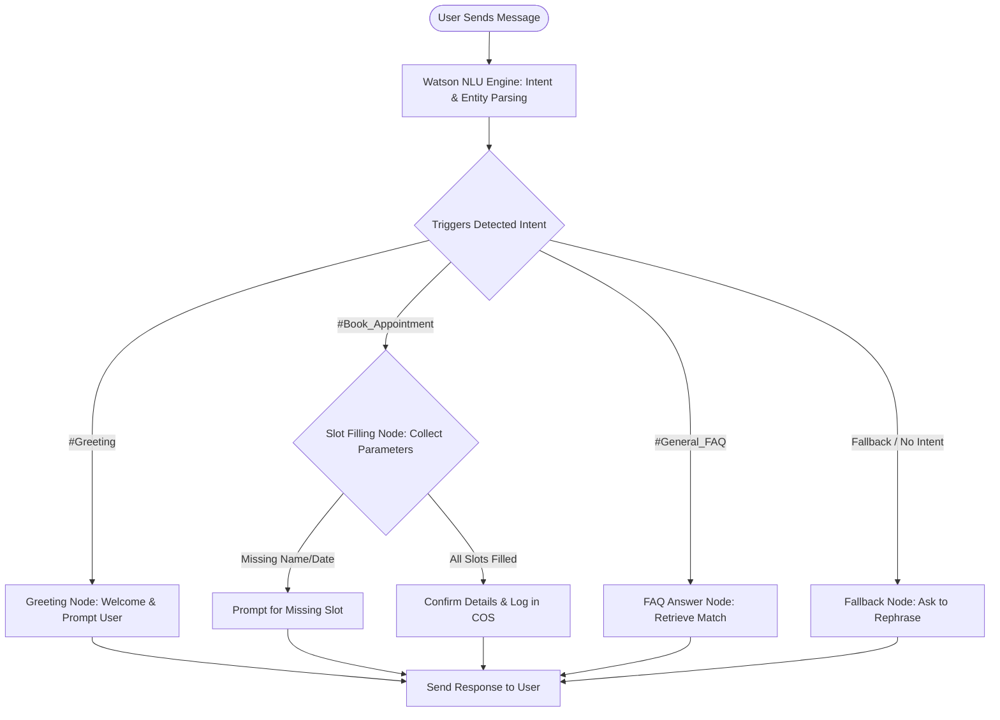

# Graded Internship Assignments & Labs

This directory contains the weekly graded coursework and laboratory reports submitted during the internship program. The deliverables cover cloud-based data science workflows, automated model optimization, and natural language conversational interfaces.

---

## 🤖 IBM Watson Assistant Dialog Flow Diagram

The flowchart below demonstrates the conversational flow architecture implemented for the **Watson Assistant Chatbot**:

---

## 📂 Graded Deliverables & Coursework

The coursework is structured into three main categories:

### 💬 1. Conversational Chatbot using Watson Assistant
* **Location:** [ChatBot/](file:///d:/Edunet%20Foundation%20Internship/Edunet-Foundation-Internship/Assignment/ChatBot)
* **Goal:** Design and launch a multi-turn conversational AI chatbot using the IBM Watson Assistant workspace.
* **Key Components:**
  - Defining intent triggers (`#Greeting`, `#FAQ`, `#Services`).
  - Training custom entity recognizers (`@Location`, `@ServiceType`).
  - Implementing dialog trees with slot-filling logic to capture client data.
* **Deliverable Report:** [ChatBotUsingIBMWatsonAssitant.pdf](file:///d:/Edunet%20Foundation%20Internship/Edunet-Foundation-Internship/Assignment/ChatBot/ChatBotUsingIBMWatsonAssitant.pdf) – Outlines intent configurations and dialogue workflows.

---

### ☁️ 2. Automated Machine Learning on Cloud (AutoAI)
* **Location:** [AutoAI/](file:///d:/Edunet%20Foundation%20Internship/Edunet-Foundation-Internship/Assignment/AutoAI)
* **Goal:** Develop classification and regression models using IBM Watson Studio AutoAI pipelines, comparing automatic optimization with manual Jupyter Notebook implementation.
* **Key Components:**
  - Automated feature engineering and cross-validation on the Iris dataset and placement packages.
  - Exporting Python models from AutoAI to Jupyter Notebooks.
* **Deliverables:**
  - **Python Notebook:** [Iris.ipynb](file:///d:/Edunet%20Foundation%20Internship/Edunet-Foundation-Internship/Assignment/AutoAI/Iris.ipynb) – Classification implementation.
  - **Lab Report:** [DevelopMachineLearningModelToIdentifyIrisFlowerTypeusingIBMcloud.pdf](file:///d:/Edunet%20Foundation%20Internship/Edunet-Foundation-Internship/Assignment/AutoAI/DevelopMachineLearningModelToIdentifyIrisFlowerTypeusingIBMcloud.pdf) – Detailed step-by-step AutoAI deployment documentation.

---

### 📊 3. Exploratory Data Analytics Lab
* **Location:** [Data Analysis Assignment/](file:///d:/Edunet%20Foundation%20Internship/Edunet-Foundation-Internship/Assignment/Data%20Analysis%20Assignment)
* **Goal:** Cleanse and analyze large datasets using Pandas and NumPy, plotting statistical correlations and modeling features.
* **Key Components:**
  - Outlier detection and handling missing/null records.
  - Statistical summaries (`describe`, counts) and correlation mapping on COVID-19 Clinical Trials and Superstore Sales logs.
* **Deliverables:**
  - **Analytics Notebook:** [Data Analytics.ipynb](file:///d:/Edunet%20Foundation%20Internship/Edunet-Foundation-Internship/Assignment/Data%20Analysis%20Assignment/Data%20Analytics.ipynb) – Step-by-step cleaning and visualizations.
  - **Graded Lab Report:** [Data Analysis Assignment.pdf](file:///d:/Edunet%20Foundation%20Internship/Edunet-Foundation-Internship/Assignment/Data%20Analysis%20Assignment/Data%20Analysis%20Assignment.pdf)
