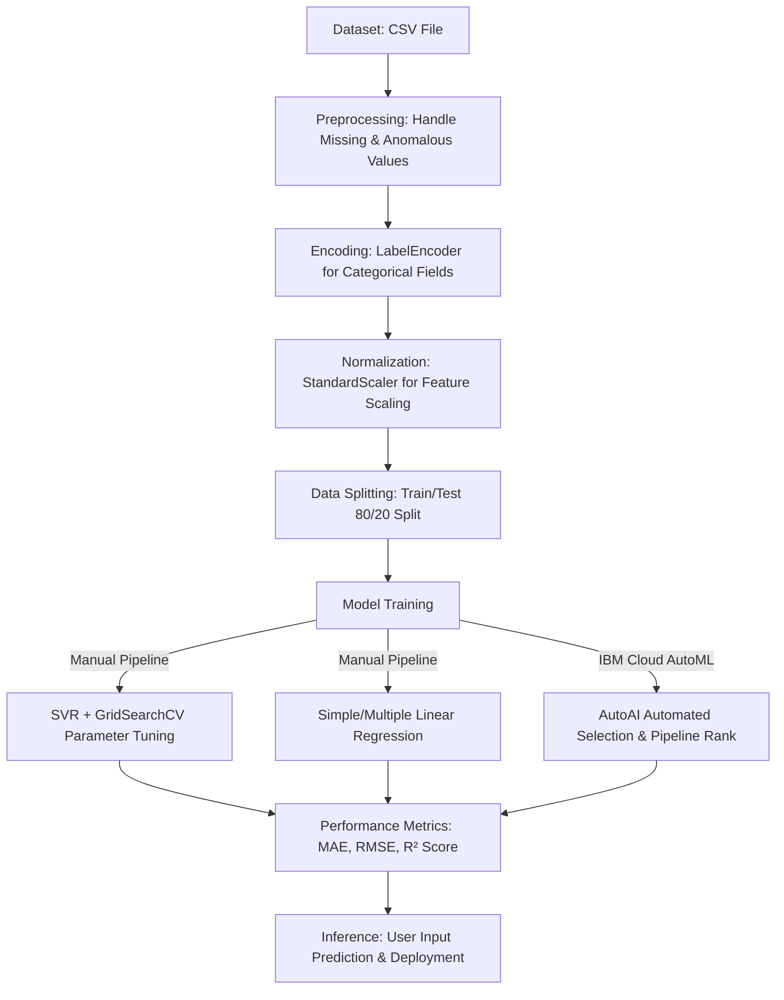

# Applied Machine Learning Projects

This directory contains the machine learning projects designed and implemented during the internship. The work spans both manually coded classical Scikit-Learn models and enterprise-grade Automated Machine Learning (AutoAI) pipelines deployed on the IBM Cloud.

---

## ⚙️ Standard Machine Learning Pipeline Workflow

---

## 🌾 Project 1: Crop Growth Prediction

* **Location:** [Crop Growth prediction/](file:///d:/Edunet%20Foundation%20Internship/Edunet-Foundation-Internship/Projects/Crop%20Growth%20prediction)
* **Objective:** Build a predictive regression model that estimates the growth index of crops based on climate variables. This allows smart farms to optimize irrigation and greenhouse conditions.

### Dataset Specifications (`crop_growth_dataset.csv`)
The dataset contains **1,000 observations** of agricultural growth conditions:
- **`Temperature`** (Float, °C): Surrounding air temperature.
- **`Humidity`** (Float, %): Relative atmospheric humidity.
- **`Soil_Moisture`** (Float, %): Moisture content in the soil.
- **`Growth`** (Float, %): **Target Variable** representing the crop growth rate index.

### Deliverables
- **Presentation:** [Crop Prediction ML model Presentation.pdf](file:///d:/Edunet%20Foundation%20Internship/Edunet-Foundation-Internship/Projects/Crop%20Growth%20prediction/Crop%20Prediction%20ML%20model%20Presentation.pdf) – Detailed explanation of data analytics, model selections, and business applications.
- **Data File:** [crop_growth_dataset.csv](file:///d:/Edunet%20Foundation%20Internship/Edunet-Foundation-Internship/Projects/Crop%20Growth%20prediction/crop_growth_dataset.csv) – Preprocessed agricultural dataset.

---

## 🎓 Project 2: Student Placement Package Prediction

* **Location:** [Placement prediction/](file:///d:/Edunet%20Foundation%20Internship/Edunet-Foundation-Internship/Projects/Placement%20prediction)
* **Objective:** Establish the mathematical correlation between a student's GPA (`CGPA`) and the salary offer package (`package`) received during placement drives.

### Dataset Specifications (`placement.csv`)
- **`cgpa`** (Float): Student's cumulative GPA.
- **`package`** (Float, LPA): **Target Variable** representing the annual salary package in Lakhs Per Annum.

### Methodology & AutoAI Comparison
1. **Classical Linear Regression:** Implemented using ordinary least squares regression (OLS) mapping the CGPA features to packages.
2. **IBM Watson AutoAI Optimization:** Uploaded the dataset to Watson Studio and launched an AutoAI experiment. Watson AutoAI automatically ran data preprocessing, feature transformations, and hyperparameter tuning across a series of regression pipelines (such as Ridge, Random Forest, Gradient Boosting, and XGBoost).

### Visualization of Results

#### Placements Linear Regression Scatter Plot
Below is the correlation plot mapping CGPA to the salary package with a regression line fit:

#### IBM Watson Studio AutoAI Pipeline Configuration
Below is the screenshot showing the AutoAI model generation pipeline, which evaluated and ranked multiple regression pipelines based on validation performance (R² score, Root Mean Squared Error):

