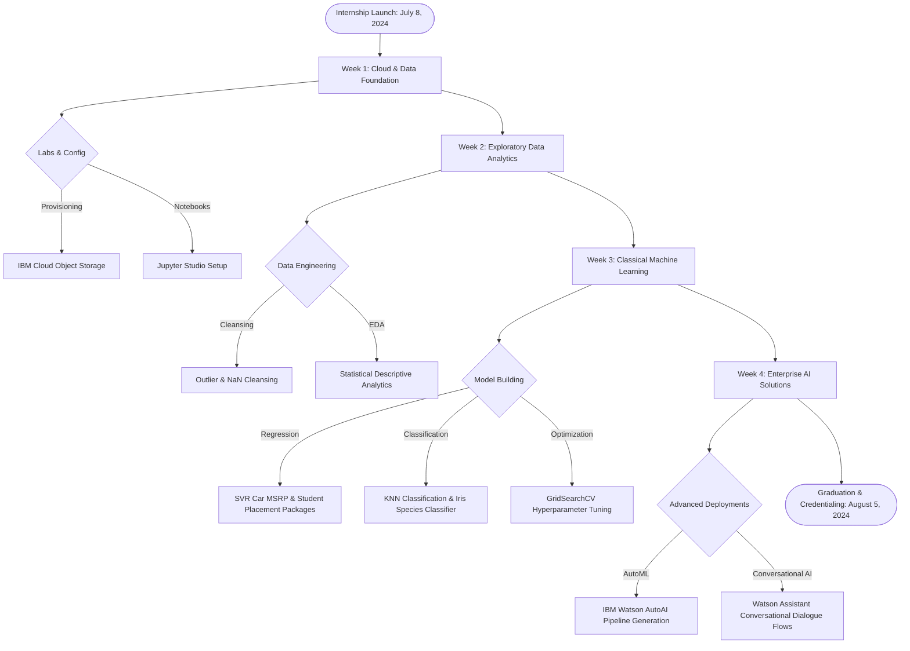

# Edunet-IBM-SkillsBuild-AI-Cloud-Internship

Welcome to the professional repository showcasing my **4-Week Industry Internship** completed under the **IBM SkillsBuild Program** in collaboration with **Edunet Foundation** and **AICTE** (July 8, 2024 – August 5, 2024). This internship was centered on emerging technologies, specifically **Artificial Intelligence (AI), Machine Learning (ML), and Cloud Computing**.

---

## 🗺️ Internship Learning & Development Journey

---

## 📅 Weekly Timeline & Core Deliverables

| Week | Phase & Core Focus | Labs & Assignments | Technologies Used | Key Artifacts & Deliverables |
| :---: | :--- | :--- | :--- | :--- |
| **Week 1** | **Cloud Infrastructures & Computing Foundations** | Cloud database provisioning, storage provisioning, and Jupyter Studio workspace configuration. | IBM Cloud, Cloud Object Storage (COS) | [IBM Jupyter Notebook Labs](file:///d:/Edunet%20Foundation%20Internship/Edunet-Foundation-Internship/IBM%20Jupyter%20notebook) |
| **Week 2** | **Exploratory Data Analytics (EDA) & cleansing** | Cleansing anomalies/outliers, statistics descriptions, and target feature distributions. | Pandas, NumPy, Matplotlib, Seaborn | [COVID trials and Superstore Analytics](file:///d:/Edunet%20Foundation%20Internship/Edunet-Foundation-Internship/Assignment/Data%20Analysis%20Assignment) |
| **Week 3** | **Classical Machine Learning Models** | SVR Car MSRP Pricing Regression, Student Placement Packages, and KNN Adult Census Classifier. | Scikit-Learn, StandardScaler, GridSearchCV | [Local Practice Regression & Classification Models](file:///d:/Edunet%20Foundation%20Internship/Edunet-Foundation-Internship/Practice) |
| **Week 4** | **Enterprise AutoAI & Conversational Agents** | Designing multi-turn conversational agents with state-based dialog trees, and automated ML pipelines. | IBM Watson Assistant, IBM Watson Studio | [Crop Growth Presentation & Placement Prediction AutoML](file:///d:/Edunet%20Foundation%20Internship/Edunet-Foundation-Internship/Projects) |

---

## 📂 Repository Architecture & Directory Mapping

You can navigate to each component of this repository directly using the interactive links below:

* 🚀 **[Projects/](file:///d:/Edunet%20Foundation%20Internship/Edunet-Foundation-Internship/Projects)**: End-to-end applied ML models.
  * [Crop Growth prediction/](file:///d:/Edunet%20Foundation%20Internship/Edunet-Foundation-Internship/Projects/Crop%20Growth%20prediction): Predicts plant yields based on temperature, humidity, and soil moisture features.
  * [Placement prediction/](file:///d:/Edunet%20Foundation%20Internship/Edunet-Foundation-Internship/Projects/Placement%20prediction): AutoAI model predicting student salary packages based on academic CGPA.
* 📝 **[Assignment/](file:///d:/Edunet%20Foundation%20Internship/Edunet-Foundation-Internship/Assignment)**: Weekly graded coursework submissions.
  * [AutoAI/](file:///d:/Edunet%20Foundation%20Internship/Edunet-Foundation-Internship/Assignment/AutoAI): IBM Cloud-based automated model optimization experiments.
  * [ChatBot/](file:///d:/Edunet%20Foundation%20Internship/Edunet-Foundation-Internship/Assignment/ChatBot): Dialog trees and intent schema definitions for Watson Assistant.
  * [Data Analysis Assignment/](file:///d:/Edunet%20Foundation%20Internship/Edunet-Foundation-Internship/Assignment/Data%20Analysis%20Assignment): Comprehensive EDA on COVID clinical trials.
* 🛠️ **[Practice/](file:///d:/Edunet%20Foundation%20Internship/Edunet-Foundation-Internship/Practice)**: Self-guided notebook implementations on classical regression/classification.
* 📚 **[Study material/](file:///d:/Edunet%20Foundation%20Internship/Edunet-Foundation-Internship/Study%20material)**: Textbooks, IBM cloud prompt engineering cheat sheets, and official reference documents.
* 🎓 **[Certificates/](file:///d:/Edunet%20Foundation%20Internship/Edunet-Foundation-Internship/Certificates)**: Official credentials proving course completions.

---

## 🏆 Featured Machine Learning Projects

### 🌾 Crop Growth Prediction
- **Goal:** Predict crop growth rates (`Growth`) using environmental features (`Temperature`, `Humidity`, `Soil Moisture`).
- **Methodology:** Implemented regression pipelines using data normalization, handling continuous parameters, and analyzing target variances.
- **Project Folder:** [Crop Growth prediction/](file:///d:/Edunet%20Foundation%20Internship/Edunet-Foundation-Internship/Projects/Crop%20Growth%20prediction)

### 🎓 Student Placement Prediction (AutoAI)
- **Goal:** Establishes the relationship between academic Performance (`CGPA`) and salary offer (`Package`).
- **Methodology:** Compared manual Linear Regression models with IBM Watson Studio AutoAI pipelines, utilizing automated feature engineering and model ranking.
- **Project Folder:** [Placement prediction/](file:///d:/Edunet%20Foundation%20Internship/Edunet-Foundation-Internship/Projects/Placement%20prediction)

---

## 🎓 Credentials & Achievements

For completing the internship requirements, I was awarded the official completion certificate and credentials by the **Edunet Foundation** and the **IBM SkillsBuild Program** in collaboration with **AICTE**:

* **Internship Certificate:** [View Certificate PDF](file:///d:/Edunet%20Foundation%20Internship/Edunet-Foundation-Internship/Edunet%20Foundation%20Internship%20Certificate.pdf)

---

## 👤 Contact & Professional Profile

* **Name:** Keshab Kumar
* **Institute:** NOIDA Institute of Engineering & Technology (NIET)
* **LinkedIn:** [@keshabkjha](https://www.linkedin.com/in/keshabkjha)
* **Linktree:** [Keshabkjha](https://linktr.ee/Keshabkjha)
* **Email:** keshabkumarjha876@gmail.com
